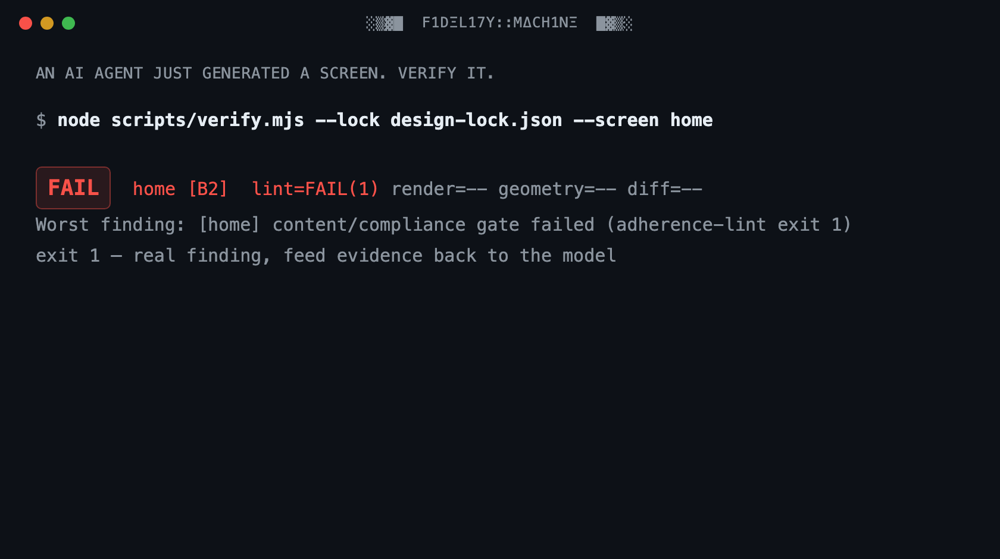

# fidelity-machine

```
░▒▓█  F1DΞL17Y::MΔCH1NΞ  █▓▒░
```

**AI can finally prototype in your design system, but only if something refuses the results that drift off it. This is that something.**

fidelity-machine locks your design system into a frozen, machine-readable mold. Then it lets an AI agent produce screens, social visuals, decks, and poster artwork *through* that mold, with a verification gate that measures every result and rejects anything off-system. Pixel by pixel. Word by word.



New here? Take the 15-minute [guided tour](GUIDE.md): you break the practice system on purpose and watch the gate catch you. Questions first? Read the [FAQ](FAQ.md).

---

## Why this exists

Almost every design tool with "AI" on the label chases the same prize: **more output, faster**. More screens, more variants, more mockups per prompt. Speed is a solved problem. What nobody solved is the question your design system team asks about every one of those artifacts:

> *"Is this actually ours?"*

Generation without verification is how brands dissolve. An AI that produces a hundred screens an hour produces drift a hundred times an hour: a radius that's almost right, a gray that's almost warm, a headline font that's almost yours, a disclaimer that quietly vanished. Each one plausible. Each one wrong. And the person who has to catch it is you, squinting at thumbnails at 6pm.

fidelity-machine inverts the priority. **Fidelity above all else.** It treats your design system the way a foundry treats a mold: you capture the system once (every token, every type role, every spacing step, every mandated sentence of legal copy) into a single frozen artifact called the **design lock**. From then on, the lock is the only authority. The machine renders what the AI produced and measures it against the lock: geometry, pixels, typography, color, copy. Then it returns one of two verdicts.

**Green: it left the mold clean. Red: back into the fire, with the exact defect, the exact pixel region, and the exact rule it broke.**

No taste debates. No "I feel like the spacing is off." No brand police. The machine flagged it, not you.

## The pains this ends

**If you're a designer inside a company with a strict design system:**

- **Thumbnail-squinting QA.** You review AI or agency output by eye, at speed, and off-brand details slip through anyway. Here, a diff gate measures every pixel against the reference and shows you the worst region, cropped, side by side.
- **The almost-right problem.** `#F8F6F2` became `#F5F5F5`. A 12px radius became 10px. Nobody catches this in a meeting; the lint catches it in milliseconds, with the file and line.
- **Feedback fights.** "That's off-brand" starts an argument when it comes from a person. It ends one when it comes from a deterministic check with a rule ID attached. The verdict is depersonalized: findings cite the violated rule, never taste.
- **Legacy drift.** Ten years of a design system means five eras of it in production. The lock is one dated, versioned truth, and everything is measured against *that*, not against whichever era a contributor remembers.
- **Legal copy that quietly disappears.** Mandatory disclosures are registered in the lock, and the gate blocks any screen missing them, regardless of how good it looks.
- **AI slop anxiety.** You want the speed of AI prototyping; you dread defending its output. The gate is your defense: nothing reaches review that didn't pass the mold.

**If you manage a design team and wish they prototyped more with AI:**

- **Adoption without abdication.** Your team avoids AI tools because the output embarrasses the system you spent years building. Give them a machine that refuses embarrassing output, and the objection dissolves.
- **A number instead of a feeling.** Every artifact ships with its measurements: global diff percentage, worst region, rounds to convergence, rules checked. "Is it on-brand?" becomes a report, not a meeting.
- **Junior output at senior fidelity.** The lock encodes what your senior designers know: the signatures that make your brand *yours*, the values that are banned, the copy register that is mandatory. Everyone produces against the same mold.
- **A brand-transplant test, on demand.** The review gate asks the question that matters: swap the logo and the accent color for a competitor's. Does anything else still identify us? If not, the work is generic, whatever the tokens say.
- **An audit trail for the design system itself.** Every mandate is a dated decision record. Every derived file is hash-chained to its source. When someone asks who decided this and when, the lock answers.

## What this is, exactly

fidelity-machine is a **verification pipeline for AI-assisted design work**: a set of deterministic command-line gates plus a template for teaching an AI coding agent your design system.

It is **not** a design app. There is no canvas. It is **not** an image generator; it does not call image models. It works with an AI coding agent (built for [Claude Code](https://claude.com/claude-code); the gates themselves are agent-agnostic CLIs) that generates HTML/CSS artifacts, and it verifies those artifacts mechanically.

What it produces and verifies: anything with a fixed canvas that a browser can render. That covers **app screens, web pages, social visuals (1080×1350 and friends), slide decks, digital posters, badges, and roll-up artwork**. True print production (CMYK, bleed, dielines) is out of scope: export your verified artwork as PNG/PDF and let your print shop manage color.

The two-layer design keeps your brand private while the machine stays public:

```
fidelity-machine/          <- this repository: brand-agnostic machinery (public)
your-brand skill/          <- your lock, fonts, captures, references (private, yours)
```

A release gate inside the machine (`release-check`) proves the public layer contains zero brand traces: it scans for banned terms, credential patterns, and private paths on every run.

## How this is different

Most tools in the "AI + design" space are not competitors of this machine. They sit at other points of the workflow, and most of them combine well with it.

| Category | What it does well | What it does not do |
|---|---|---|
| **Prompt-to-UI generators** | Produce screens and variants fast, from a text prompt | Verify anything. The output *looks* like your system; nothing measures whether it *is* |
| **Design-token pipelines** (Style Dictionary, Tokens Studio and friends) | Define and distribute your tokens as data | Check the produced artifact. A perfect token file cannot stop a screen from ignoring it |
| **Design-file linters** (Figma plugins) | Catch off-system values inside the design file | Check what actually ships. The drift between the file and the artifact is exactly where brands dissolve |
| **Brand portals and PDF guidelines** | Document the rules for humans | Enforce them. A guideline nobody re-reads is a wish, not a system |
| **fidelity-machine** | Renders the produced artifact, measures it against the frozen lock (geometry, pixels, type, color, copy), and refuses what fails | Generate or design anything by itself |

The relationship with generators is the one worth underlining: **use any generator you like. This is the gate its output must pass.** The faster your team generates, the more you need the layer that says no.

One honest acknowledgment: the idea has been attempted before. A small project called *driftguard* described itself as a deterministic design-system compliance engine and went quiet at version 0.1.1. The thesis was right. This is that thesis carried through: a full pipeline, a contract that enforces itself, and gates that are proven able to fail before they are trusted to pass.

## How it works

1. **Capture:** an AI agent reads your design system (from Figma via MCP, or from reference images) and compiles it into `design-lock.json`: colors per theme, the complete spacing scale, type roles, radii, elevation, mandated copy, banned jargon, brand signatures, hard don'ts. The lock is the mold. It is frozen: derived files are hash-chained to it, and hand-editing them fails the gate.
2. **Generate:** the agent produces screens *from the lock only*. Raw hex outside the token sheet fails. An off-scale spacing value fails. A font substitute fails. Lorem ipsum fails.
3. **Verify:** the pipeline runs, in fixed order: content and compliance lint, then structured self-critique (including the brand-transplant test), then the geometry gate, then the pixel diff against the reference with per-region ceilings. Thresholds are law: a stubborn screen gets diagnosed, never a loosened gate.
4. **Report:** green ships with its numbers. Red returns with the defect, the region crop, and the rule. The loop runs at most four rounds, keeps the best result, and stops honestly instead of thrashing.

---

## Installation

The instructions below use short, direct sentences (ASD-STE100 style). Do the steps in order. Each step shows you how to make sure it worked.

### What you need

- A computer with macOS or Linux. Windows is not tested.
- Node.js version 20 or later. To check, type `node --version`.
- Git. To check, type `git --version`.
- Approximately 500 MB of free disk space. The browser download uses most of it.
- For the capture flow: [Claude Code](https://claude.com/claude-code) with the Figma MCP server. This is optional for the first test.

### Step 1: Get the code

Open a terminal. Type these commands:

```bash
git clone https://github.com/tudorjuravlea/fidelity-machine.git
cd fidelity-machine
```

The folder can be in any location. The scripts find their own path.

### Step 2: Install the dependencies

Type this command:

```bash
npm install
```

Wait for the command to complete. Then install the browser that makes the screenshots:

```bash
npx playwright install chromium
```

**Note:** The machine uses one exact browser build for all screenshots. This makes each screenshot identical between runs. Do not use a different browser.

### Step 3: Make sure the installation is correct

Type this command:

```bash
node scripts/setup-check.mjs
```

Read the output. Make sure the last line shows `READY`. If a dependency is missing, the output shows the exact command that installs it. Run that command. Then do this step again.

### Step 4: Run the self-test

Type this command:

```bash
node scripts/contract-guard.mjs --self-test
```

This test runs the full pipeline on a small example system. Make sure the result line shows `PASS`. If the result shows `PASS`, your installation is correct and complete.

### Step 5: Create your brand skill

Type this command. Replace `my-brand` with the name of your design system, in lowercase, with hyphens:

```bash
node scripts/new-system.mjs --name my-brand --title "My Brand"
```

This makes a new folder for your brand, with a skill file for the AI agent. Your brand data stays in this folder. It does not go into the machine.

### Step 6: Capture your design system

Open the new skill in your AI agent. Ask the agent to run the capture flow. The flow is in `references/spec-capture.md`. The agent reads your design system and writes the lock file.

**Note:** Give the agent access to your Figma file, or give it reference images. The agent cannot capture a design system from memory. The machine blocks generation when there is no lock.

### Step 7: Calibrate your computer

Each computer renders with a very small, constant difference. Measure it one time:

```bash
node scripts/verify.mjs --lock <path-to-your-lock> --calibrate
```

The result goes into the lock. The thresholds sit above this measured floor. Do this step again only when you change the browser build or the computer.

### Step 8: Generate and verify your first screen

Ask the agent to generate a screen from the lock. Then verify it:

```bash
node scripts/verify.mjs --lock <path-to-your-lock> --screen <screen-id>
```

Read the report. Green shows the measurements. Red shows the defect, the region, and the rule. Send the red findings back to the agent. The agent corrects the screen. Run the verification again.

### Configuration reference

| Task | Command |
|---|---|
| Check the installation | `node scripts/setup-check.mjs` |
| Run the full self-test | `node scripts/contract-guard.mjs --self-test` |
| Validate a lock file | `node scripts/contract-guard.mjs --lock <path>` |
| Verify one screen | `node scripts/verify.mjs --lock <path> --screen <id>` |
| Measure the machine floor | `node scripts/verify.mjs --lock <path> --calibrate` |
| Check the tree before a release | `node scripts/release-check.mjs` |

All scripts use the same exit codes: `0` = pass, `1` = a real finding, `2` = a setup or usage error. The full contract is in `CONTRACT.md`.

---

## The fine print, honestly

- **You need an AI coding agent.** The machine verifies; the agent generates. Without an agent, you have a very strict linter and no hands.
- **Your fonts stay yours.** Licensed brand fonts live in your private skill folder, never in this repository. The renderer refuses to screenshot a fallback font; it fails loudly instead.
- **Screens without a reference image still get gated.** Content lock, compliance lint, and self-critique carry them, and the report says exactly which gates ran. The machine never claims a measurement it didn't make.
- **A screen that doesn't converge ships as "not converged," with its residual, or it doesn't ship.** The gate never rounds in its own favor.

## License

Apache-2.0: see `LICENSE` and `NOTICE`. Contributions welcome. Read `CONTRIBUTING.md` first (three rules: the contract comes first, every check must be able to fail, the machine stays brand-neutral).

**Where to write:** bugs, questions, and ideas all go to [Issues](../../issues). For a failure, paste the command and its full output; the scripts' findings format is built to be pasted.
